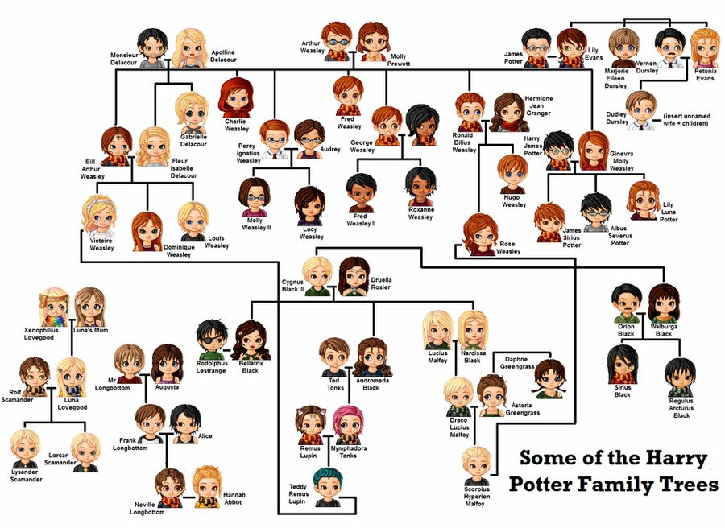

# CSCI 2275 Final Project: Family Tree

### Project Summary
This project consists of a program that can store a family tree. 

The two data structures I've used are: a graph to store the family tree, and linked lists that are returned as part of functions within the family tree. 

The family tree is designed so that there is a struct for each person and a struct for the family that the people are connected to; therefore, it is a bit more complex than just an ordinary graph. (i.e., the people structs do not have adjacency matrices, but the families do have adjacency matrices of people. Inspired by [this article](https://medium.com/@bigomega/building-my-family-tree-ef0be1fba775).)

The family tree can be built from a CSV file, but it also has functions that allow the user to manually input. It also has functions that allow the user to find common ancestors, siblings, family members, etc., of members of the tree. Linked lists are returned in some of these functions (ex. for the siblings function call, a linked list of siblings is returned).

The test CSV file provided is based on some of the family trees from the Harry Potter series (it was the easiest fictional family tree I could think of). Below is a diagram of the family trees that the CSV file represents: 

### How to Run
Included in the files is a shell script (**run.sh**), that has commands for compiling and running the program using the given testinputtree.csv file. On a UNIX system (Mac/Linux), you should just be able to run the command:

    ./run.sh

You can change the input CSV file by changing "testinputtree.csv" in the shell file to the name of the file you want to input. 

If you have trouble running the shell file, you should also be able to manually type in these commands to the terminal to compile and run the program. Make sure you are in the directory that the program files are stored in. 

    g++ -std=c++11 FamilyTree.cpp LinkedList.cpp main.cpp
    ./a.out testinputtree.csv

### Dependencies
I'm not aware of any dependencies this program requires to run, outside of the standard C++ library. 

### System Requirements
This program was built and tested on a Mac, but I believe it should work as expected on any UNIX system. I have not tested the program on Windows so I'm not sure what to expect there, but in theory it should work the same. 

### Team Members
Lauren Funston

### Contributors 

### Open issues/bugs
Right now the code only supports families with two parents (i.e., no single parents). It also doesn't allow for divorces or remarriages. While this isn't necessarily a bug in the code at the moment, it is an area where the program could be enhanced to cover these cases. 